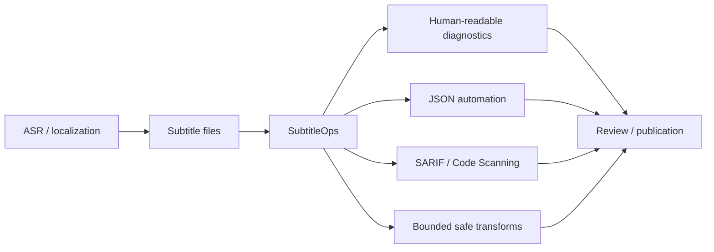
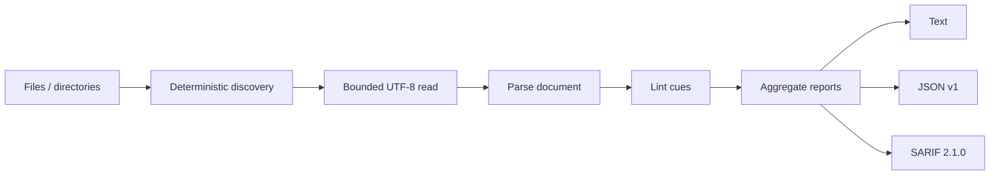
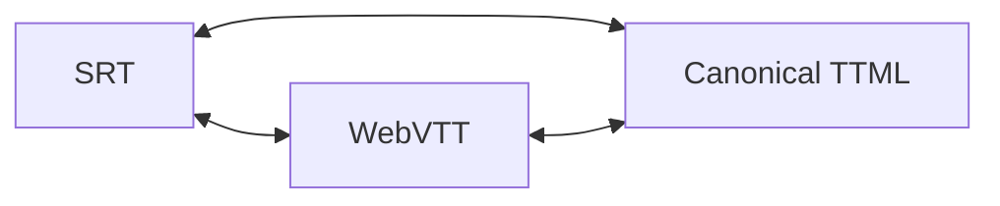
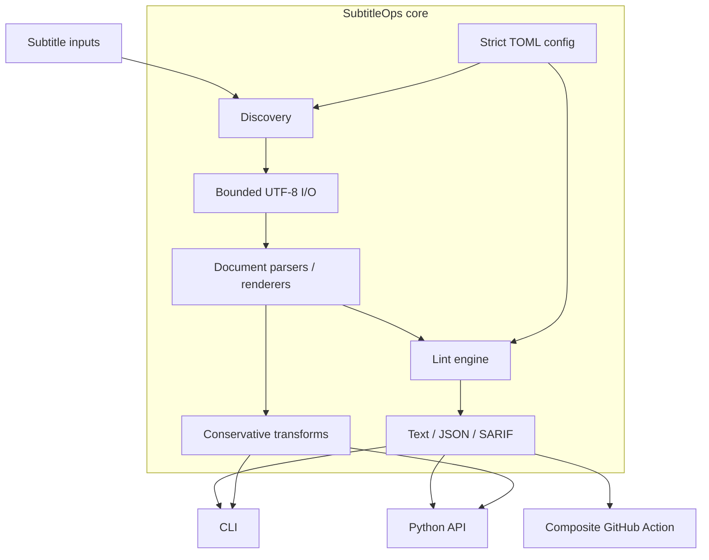

<div align="center">

# SubtitleOps

### Deterministic subtitle QA · SRT · WebVTT · TTML / DFXP · JSON · SARIF · GitHub Actions

**A subtitle quality gate that can fail a pipeline for explainable reasons — without rewriting the dialogue behind your back.**

[](https://github.com/jerry0327/SubtitleOps/actions/workflows/ci.yml)
[](https://github.com/jerry0327/SubtitleOps/actions/workflows/codeql.yml)
[](https://github.com/jerry0327/SubtitleOps/releases)

[](LICENSE)


**[Quick start](#quick-start)** · **[Quality gate](#quality-gate)** · **[Formats](#format-semantics)** · **[GitHub Action](#reusable-github-action)** · **[Architecture](#architecture)**

</div>

---

**SubtitleOps** is a deterministic quality gate for text subtitles. It checks individual files or whole directory trees, reports stable diagnostics in **text / JSON / SARIF**, and performs deliberately conservative timing or whitespace repair.

It is designed to sit between **transcription / localization** and **publication / release**:



> [!IMPORTANT]
> SubtitleOps does **not** perform ASR, translation, semantic rewriting, media muxing, bitmap-subtitle processing, or visual-render comparison. It is a deterministic subtitle-file QA layer.

## Why SubtitleOps

Subtitle failures are awkward in automation: generic linters do not understand cue timing, while interactive editors are difficult to enforce consistently in CI.

SubtitleOps turns subtitle quality into an explicit engineering contract:

| Requirement | Behavior |
| --- | --- |
| Reproducible results | deterministic discovery, checking, sorting, JSON and SARIF output |
| Explainable failures | stable rule IDs instead of an opaque quality score |
| CI integration | exit codes `0 / 1 / 2`, JSON schema v1, SARIF 2.1.0 |
| Untrusted batches | 10 MiB default bounded read, per-file error isolation |
| Safe directory scanning | include/exclude globs, no directory-symlink traversal, path de-duplication |
| Conservative repair | whitespace/timing transforms only; unsupported lossless mutation is refused |
| Cross-format work | SRT ↔ WebVTT ↔ canonical TTML conversion |
| Supply-chain use | reusable composite GitHub Action + versioned GitHub releases |

## Quality gate

The check path is intentionally simple and inspectable:



Checking may run concurrently, but reports are sorted after workers complete, so thread scheduling does not change the final ordering.

A malformed or oversized file is isolated as its own operational error; it does not erase results from the rest of the batch.

### Diagnostic surface

SubtitleOps currently exposes **20 stable diagnostic codes**: 13 lint rules and 7 operational diagnostics.

#### Timing / structure

- `TIMING_ORDER`
- `NEGATIVE_START`
- `OUT_OF_ORDER`
- `OVERLAP`
- `DUPLICATE_IDENTIFIER`

#### Readability / content

- `DURATION_TOO_SHORT`
- `DURATION_TOO_LONG`
- `READING_SPEED`
- `LINE_TOO_LONG`
- `TOO_MANY_LINES`
- `EMPTY_TEXT`
- `TRAILING_WHITESPACE`
- `CONTROL_CHARACTER`

#### Operational

- `PARSE_ERROR`
- `IO_ERROR`
- `DECODE_ERROR`
- `FILE_TOO_LARGE`
- `INPUT_NOT_FOUND`
- `UNSUPPORTED_FORMAT`
- `NO_FILES`

Every code has a name, severity, category, description, and documentation URI.

```bash
subtitleops rules
subtitleops rules --json
subtitleops rules --all
```

## Quick start

Current release: **v0.3.0 alpha**. Python **3.10–3.14** is supported.

Install the tagged release:

```bash
python -m pip install \
  "git+https://github.com/jerry0327/SubtitleOps.git@v0.3.0"

subtitleops --version
subtitleops check subtitles/
```

SubtitleOps is not currently presented as a PyPI-distributed package; GitHub releases contain the public wheel, source distribution, and SHA-256 checksums.

### Check one file or a tree

```bash
subtitleops check subtitles/en.srt
subtitleops check subtitles/
subtitleops check captions/ trailers/ release.ttml --jobs 8
```

Example policy controls:

```bash
subtitleops check subtitles/ \
  --max-cps 18 \
  --max-line-length 40 \
  --max-lines 2 \
  --min-duration-ms 300 \
  --max-duration-ms 7000 \
  --max-file-bytes 10485760 \
  --exclude "archive/**" \
  --ignore TRAILING_WHITESPACE
```

`--jobs 0` selects a bounded automatic worker count. `--max-file-bytes 0` explicitly disables the bounded-read guard.

## Reports + exit contract

```bash
subtitleops check subtitles/ --json -o build/subtitleops.json
subtitleops check subtitles/ --sarif -o build/subtitleops.sarif
```

| Exit | Contract |
| ---: | --- |
| `0` | Check completed; no finding met the configured failure threshold |
| `1` | Check completed; at least one finding met `fail_on` |
| `2` | Configuration, discovery, size, decoding, parsing, or I/O failed |

Operational errors always take precedence.

The failure threshold controls the **exit decision**, not report visibility:

```bash
subtitleops check subtitles/ --fail-on error
subtitleops check subtitles/ --fail-on none
```

### SARIF is a first-class output

SARIF results include:

- stable `ruleId`
- GitHub-compatible severity levels
- source-file / source-line locations where available
- cue timing metadata
- deterministic partial fingerprints
- operational vs lint distinction
- invocation summary and exit code

The fingerprint intentionally avoids dependence on source-line movement and is derived from artifact URI, rule code, cue identity and timing.

## Format semantics

SubtitleOps uses an immutable cue model with **integer millisecond timing** to avoid floating-point drift.

```text
Cue
├── start_ms
├── end_ms
├── text
├── identifier?
├── settings?
└── source_line?
```

A `SubtitleDocument` additionally stores format-level information that can be preserved safely.

### SRT

- line/block parser
- optional identifiers accepted
- millisecond timestamps
- canonical render renumbers cues

### WebVTT

WebVTT handling is document-aware rather than cue-only:

- validates `WEBVTT` signature / header separation
- preserves header metadata
- preserves non-numeric cue identifiers
- preserves cue settings
- preserves document-level `NOTE`, `STYLE`, and `REGION` blocks
- preserves those blocks at their cue-relative positions during same-format repair

That means a same-format `fix` does not need to flatten a WebVTT file into a generic cue list and throw away document structure.

### TTML / DFXP

The supported subset is intentionally broader than simple `HH:MM:SS.mmm` cues while remaining conservative.

Parser support includes:

- media time base
- clock expressions
- offset expressions (`h`, `m`, `s`, `ms`)
- frame / sub-frame timing when `frameRate` is provided
- tick timing
- `frameRateMultiplier`
- nested parallel timed containers
- ancestor-relative timing
- `xml:space="default"` / `preserve`
- `<br>` text breaks
- untimed inline descendants

Security / loss boundaries include:

- `DOCTYPE` / `ENTITY` declarations rejected before XML parsing
- non-`par` `timeContainer` rejected
- nested `<p>` and timed descendants inside a cue rejected
- same-format TTML rewriting refused because styling, layout, metadata, or inline semantics could otherwise be silently discarded

Canonical TTML output therefore represents **cue text + timing**, not arbitrary source-document presentation semantics.

See [`docs/formats.md`](docs/formats.md).

## Conservative repair + conversion

### Normalize text

Normalization only removes boundary blank lines, converts line endings, and trims trailing whitespace. It does not paraphrase subtitle wording.

### Shift timing

```bash
subtitleops fix captions.vtt --shift-ms 750
```

A negative shift is clipped for the **whole track** if necessary so the earliest cue never moves before zero; cue durations remain unchanged.

### Resolve overlaps

```bash
subtitleops fix captions.srt --resolve-overlaps
```

An overlap is repaired only when clipping the current cue end to the next cue start still leaves at least the configured minimum duration.

### Convert formats

```bash
subtitleops convert captions.srt captions.vtt
subtitleops convert captions.vtt captions.ttml
subtitleops convert captions.ttml captions.srt
```



The arrows describe supported cue-level conversion paths; they do **not** imply lossless round-tripping of arbitrary TTML styling/layout.

## Configuration

SubtitleOps searches upward for:

1. `.subtitleops.toml`
2. `pyproject.toml` containing `[tool.subtitleops]`

```toml
version = 1

[check]
max_cps = 18.0
max_line_length = 40
max_lines = 2
min_duration_ms = 300
max_duration_ms = 7000
max_file_bytes = 10485760
fail_on = "warning"
ignore = ["TRAILING_WHITESPACE"]
include = ["*.srt", "*.vtt", "*.ttml", "*.dfxp"]
exclude = ["vendor/**", "archive/**"]
recursive = true
jobs = 0
allow_empty = false
```

Unknown configuration keys and unknown ignored rule codes are errors rather than silently ignored typos.

CLI values override file settings. Use `--config PATH` for an explicit file or `--no-config` for reproducible defaults.

## Reusable GitHub Action

SubtitleOps is also a composite GitHub Action, not just a CLI package.

```yaml
name: Subtitle quality
on: [pull_request]

permissions:
  contents: read
  security-events: write

jobs:
  subtitleops:
    runs-on: ubuntu-latest
    steps:
      - uses: actions/checkout@v7
        with:
          persist-credentials: false
      - uses: jerry0327/SubtitleOps@v0.3.0
        with:
          paths: |
            subtitles/
            trailers/captions.vtt
          upload-sarif: "true"
          fail-on: warning
```

The action exposes:

- `exit-code`
- `files-checked`
- `issues`
- `report-path`

Its internal runner records the SubtitleOps result first, allowing outputs and optional SARIF upload to complete before a final step applies the quality-gate exit code.

For production, pin an immutable release tag or full commit SHA. The release workflow also moves the convenience `v0` tag to the newest compatible 0.x action release.

See [`docs/github-action.md`](docs/github-action.md).

## Architecture



### Runtime modules

| Module | Responsibility |
| --- | --- |
| `checking.py` | deterministic batch execution + per-file isolation |
| `discovery.py` | recursive selection, globs, de-duplication, symlink policy |
| `fileio.py` | bounded UTF-8/BOM reads + atomic writes |
| `formats.py` | SRT / WebVTT / TTML detection, parsing and rendering |
| `linting.py` | non-mutating cue diagnostics |
| `rules.py` | stable rule metadata and help URIs |
| `reporting.py` | text, JSON schema v1 and SARIF 2.1.0 |
| `transforms.py` | whitespace normalization, shifts, bounded overlap repair |
| `config.py` | strict config discovery / validation |
| `cli.py` | `check`, `fix`, `convert`, `rules` |

Python 3.11+ uses a standard-library runtime; Python 3.10 adds only `tomli` for TOML compatibility.

## CI + release engineering

The CI workflow validates more than a basic unit-test job:

| Gate | Coverage |
| --- | --- |
| Python matrix | 3.10, 3.11, 3.12, 3.13, 3.14 |
| Additional OS coverage | Windows + macOS on Python 3.12 |
| Unit tests | action, checking, CLI, config, discovery, I/O, formats, TTML, linting, reporting, rules, transforms |
| Compile checks | package, tests and action runner |
| CLI smoke | rules, check, SRT→TTML→VTT conversion |
| Machine reports | JSON schema v1 + SARIF 2.1.0 validation |
| Composite action | self-test with outputs + SARIF artifact |
| Distribution gate | wheel / sdist content verification |
| Clean install | wheel installed in a fresh venv and exercised |
| Security | CodeQL |

### Release path

A `vX.Y.Z` tag triggers a release job that:

1. validates repository metadata;
2. verifies tag == package version;
3. reruns tests / compile checks;
4. builds wheel + sdist;
5. smoke-installs the wheel;
6. writes `SHA256SUMS`;
7. creates the GitHub release;
8. advances the floating `v0` action tag.

Current public release **v0.3.0** contains a wheel, source distribution and checksum file.

## Security + input boundaries

The core checker intentionally has a narrow attack surface:

- no shell execution from subtitle contents
- no network access during checks
- no codec / ffmpeg invocation
- explicit UTF-8 decoding
- configurable bounded reads, default 10 MiB per file
- no directory-symlink traversal during discovery
- TTML `DOCTYPE` / `ENTITY` rejected
- atomic same-directory output replacement
- unsupported potentially lossy mutation fails instead of silently flattening content

## Python API

```python
from pathlib import Path
from subtitleops import CheckConfig, run_check

report = run_check(
    [Path("subtitles")],
    CheckConfig(max_cps=18.0, fail_on="error", jobs=4),
)

for file in report.files:
    for issue in file.issues:
        print(file.path, issue.code, issue.cue, issue.message)

raise SystemExit(report.exit_code())
```

The public package also exports cue/document models, SRT/VTT/TTML parsers and renderers, `lint_cues`, configuration loading, and document-aware WebVTT APIs.

## Development

```bash
git clone https://github.com/jerry0327/SubtitleOps.git
cd SubtitleOps
python -m pip install -e ".[dev]"
python -m unittest discover -s tests -v
python -m compileall -q src tests scripts
```

## Documentation map

- [`docs/design.md`](docs/design.md) — architecture + deterministic/safety contracts
- [`docs/formats.md`](docs/formats.md) — exact format subset and preservation rules
- [`docs/rules.md`](docs/rules.md) — rule reference
- [`docs/configuration.md`](docs/configuration.md) — TOML policy
- [`docs/reporting.md`](docs/reporting.md) — text / JSON / SARIF contract
- [`docs/ci.md`](docs/ci.md) — CI patterns
- [`docs/github-action.md`](docs/github-action.md) — reusable Action interface
- [`docs/project-brief.md`](docs/project-brief.md) — scope and evidence
- [`docs/adoption.md`](docs/adoption.md) — staged adoption guidance
- [`docs/releasing.md`](docs/releasing.md) — release process

## Project status

SubtitleOps is currently **0.3.0 alpha** and pre-1.0. Public APIs and defaults may evolve, but existing diagnostic codes are not silently repurposed.

The project does not claim external adoption, download scale, or ecosystem-critical status without evidence.

## Contributing + governance

- [`CONTRIBUTING.md`](CONTRIBUTING.md)
- [`GOVERNANCE.md`](GOVERNANCE.md)
- [`CODE_OF_CONDUCT.md`](CODE_OF_CONDUCT.md)
- [`SECURITY.md`](SECURITY.md)
- [`SUPPORT.md`](SUPPORT.md)
- [`ROADMAP.md`](ROADMAP.md)

## License + citation

**MIT License.** See [`LICENSE`](LICENSE).

Citation metadata is available in [`CITATION.cff`](CITATION.cff).

---

<div align="center">

### Check the cues. Preserve the intent. Fail the pipeline for reasons you can explain.

</div>
